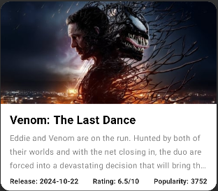

# UAB formacions: TMDB App Exercise

This application is designed as an educational exercise to learn Android development using Jetpack Compose and modern Android architecture. Follow the steps below to set up the project and complete the tasks to enhance your understanding of Compose, ViewModel logic, and unit testing.

The movie data is provided by the TMDB api: https://developer.themoviedb.org/reference/intro/getting-started

---

## Steps to Get Started

### 1. Download Android Studio and Open the Project
- Download and install [Android Studio](https://developer.android.com/studio).
- Clone or download this repository to your local machine.
- Open the project in Android Studio.

---

### 2. Create an Emulator Device
- Open the **Device Manager** in Android Studio (accessible from the toolbar or via `Tools > Device Manager`).
- Click on **Create Device** and follow the prompts to set up an emulator. Any Pixel device should work fine.
- Choose a device configuration and system image, then click **Finish**.

---

### 3. Run the App
- Click the green **Play** button in the toolbar to run the app on your emulator.
- Once the app is running, observe the Movie Feed Screen. You’ll see that the sorting options (popularity, release date, and rating) are displayed but don’t work yet.

---

### 4. Modify the `MovieCard` Function
- Open the `MovieFeedScreen.kt` file. To do a global search tap 3 times the shift key.
- Locate the `MovieCard` composable function.
- Modify it to match the implementation provided in the image. This will improve the MovieCard UI, showing more details like the release date, rating and popularity.
- 

#### Additional Info: Jetpack Compose Basics
To help you understand and modify the `MovieCard` function, here are a few key Jetpack Compose concepts:

1. **`Modifier`**
    - A `Modifier` is used to decorate or configure composables. For example:
        - Add padding: `Modifier.padding(8.dp)`
        - Set the size: `Modifier.size(100.dp)`
        - Handle user interaction: `Modifier.clickable { }`
    - [Learn more about Modifiers](https://developer.android.com/jetpack/compose/modifiers).

2. **`Text`**
    - The `Text` composable is used to display text. It supports customization like:
        - `style`: Apply typography from your app's theme.
        - `color`: Set the text color.
        - `maxLines`: Limit the number of visible lines.
    - Example:
      ```kotlin
      Text(
          text = "Movie Title",
          style = MaterialTheme.typography.h6,
          maxLines = 2,
          overflow = TextOverflow.Ellipsis
      )
      ```  
       - [Learn more about Text composable](https://developer.android.com/reference/kotlin/androidx/compose/material/package-summary#Text).
3. **`Row`**
   - The `Row` composable is used to arrange child composables horizontally. It allows you to define how items are spaced, aligned, and distributed in a horizontal layout. For example:
     - Align items: `horizontalArrangement = Arrangement.SpaceBetween`
     - Handle alignment: `verticalAlignment = Alignment.CenterVertically`
   - Example:
    ```kotlin
    Row(
        modifier = Modifier.fillMaxWidth().padding(8.dp),
        horizontalArrangement = Arrangement.SpaceBetween,
        verticalAlignment = Alignment.CenterVertically
    ) {
        Text("Left Item")
        Text("Right Item")
    }
    ```
   - [Learn more about Row composable](https://developer.android.com/jetpack/compose/layouts).

For a deeper understanding of Compose, refer to the [Jetpack Compose documentation](https://developer.android.com/jetpack/compose).

---

### 5. Run the Unit Tests
- Locate the `MovieViewModelTest` file and run the tests by clicking the green **Run** button next to each test or the class name.
- Observe that the tests fail because the sorting logic is not implemented yet.

---

### 6. Add Sorting Logic in the ViewModel
- Open the `MovieViewModel.kt` file.
- Implement logic to sort the list of movies by popularity, release date, and rating based on the selected sorting option.
- Ensure that the sorting logic updates the state, and the UI observes these changes dynamically.
- Run the app in the emulator to see it in action.

---

### 7. Rerun the Tests
- After adding the sorting logic, rerun the tests as described in Step 5.
- Continue debugging and refining the logic until all tests pass successfully.

---

## Bonus Exercises

### 8. Unify the ViewModel's StateFlows
- In the ViewModel we have two StateFlow variables, one for the `movies` and another for the `selectedSortingOption`.
- Having multiple StateFlows for the same view is usually considered bad practice, unify them into one `movieFeedState` StateFlow.
- Don't forget to update the `MovieViewModelTest`.

### 9. Implement MovieDetailActivity 
This exercise will guide you through creating a `MovieDetailActivity` in Jetpack Compose. The activity will display detailed movie information when a user taps on a `MovieCard` in the movie feed. The steps below outline the changes needed to implement this feature.

#### **1 - Add a New Activity**

- Create a new `Activity` named `MovieDetailActivity`.
- Make sure the activity is registered in the `AndroidManifest.xml` file.
- For more details on how to create a new activity, refer to the [Android documentation](https://developer.android.com/guide/components/activities/intro).

#### **2 - Enable Navigation Between Screens**

- Modify the `MovieCard` to detect user interaction when tapped.
- Use the `Intent` API to navigate from the main screen to `MovieDetailActivity` and pass the selected movie data.
- You can learn more about navigation using intents in the [Android documentation](https://developer.android.com/guide/components/intents-filters).

#### **3 - Make Movie Data Parcelable**

- Ensure the `Movie` data class implements `Parcelable` so it can be passed between components.
- Use Kotlin's `@Parcelize` annotation to simplify this process.
- For more information on working with `Parcelable`, refer to the [documentation](https://developer.android.com/kotlin/parcelize).

#### **4 - Design the MovieDetailActivity UI**

- Create a `MovieDetailScreen` composable that displays:
   - The movie's title
   - Release date
   - Popularity score
   - Rating score
   - Overview
   - Backdrop image
- Learn more about building UIs with Jetpack Compose in the [official documentation](https://developer.android.com/jetpack/compose).

#### **5 - Run the App**

- Build and run the app on an emulator or physical device.
- Tap on any movie card in the movie feed.
- Verify that the `MovieDetailActivity` opens and displays the detailed information for the selected movie.

---

## Additional Resources
- [Jetpack Compose Basics](https://developer.android.com/jetpack/compose/documentation)
- [Android ViewModel Documentation](https://developer.android.com/topic/libraries/architecture/viewmodel)
- [Unit Testing in Android](https://developer.android.com/training/testing/unit-testing)

---

## Learning Goals
By following these steps, you’ll:
- Understand how to use Jetpack Compose to build declarative UIs.
- Learn to manage app state using a `ViewModel`.
- Write and debug unit tests for Android apps.
- Improve your problem-solving and debugging skills in an Android environment.

Good luck, and happy coding! 🚀
